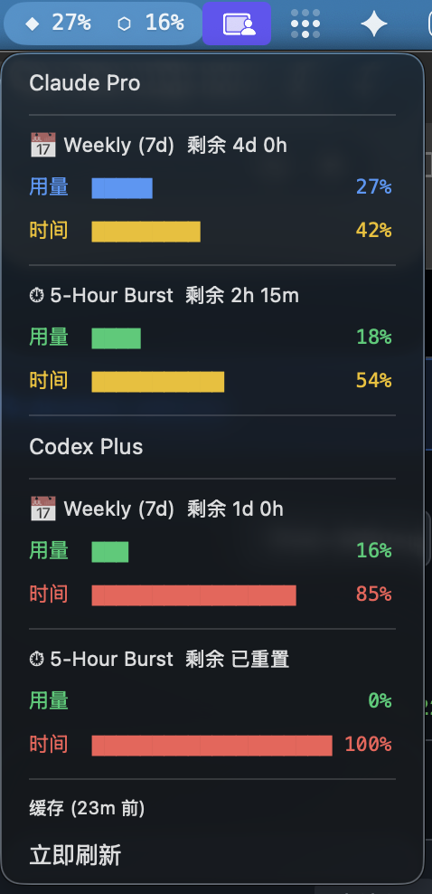

# Claude & Codex Usage SwiftBar Plugin

[中文](README.md) | English

A macOS menu bar plugin that displays your Claude Code and OpenAI Codex usage at a glance. Built for [SwiftBar](https://github.com/swiftbar/SwiftBar).

The official usage dashboards only show percentage consumed — not how much time is left in the window. 80% used with 5 days remaining is very different from 80% with 2 hours left. This plugin shows **usage progress** and **time progress** side by side so you can judge at a glance.

## Features

- **Claude + Codex in one icon** - A single menu bar entry shows both services; click to see full details
- **Real-time usage tracking** - Weekly (7-day), per-model (Sonnet/Opus), and 5-hour burst usage
- **Color-coded progress bars** - 5-tier color system (green/blue/yellow/orange/red)
- **Time progress** - See how much of each usage window has elapsed alongside consumption
- **Extra usage credits** - Track overage spending if enabled on your Claude plan
- **Smart caching** - 30-minute cache to avoid API rate limits, with manual refresh
- **Auto plan detection** - Displays your tier (Pro, Max, Max 5x, Max 20x; Codex Free/Plus/Pro)
- **Codex is optional** - Only appears when Codex sessions are detected; Claude-only if not

## Requirements

- **macOS** (SwiftBar is macOS-only)
- **Claude Code** with OAuth login (`claude login`)
- **Python 3.9+** (included with macOS)
- **OpenAI Codex** (optional — Codex section only shown if installed)

> **Note:** Claude credentials are read from macOS Keychain via OAuth. API key auth (`ANTHROPIC_API_KEY`) is not supported — you must log in with `claude login`. Codex data is read from local session files with no extra configuration needed.

## Install

### One-liner (with Claude Code)

Give this repo URL to your Claude Code and ask it to install.

### Manual

```bash
git clone https://github.com/joewongjc/claude-usage-swiftbar.git
cd claude-usage-swiftbar
./install.sh
```

The install script will:
1. Install [SwiftBar](https://github.com/swiftbar/SwiftBar) via Homebrew (if needed)
2. Verify your Claude Code OAuth credentials
3. Copy the plugin to `~/Library/SwiftBar/`
4. Install the Codex module if Codex is detected
5. Start SwiftBar if not running

## What it looks like

Menu bar shows: `◆ 55%  ⬡ 16%` (both numbers when Codex is active; title color adapts to system dark/light mode)



Clicking reveals a dropdown:

```
Claude Max 5x
─────────────────────────────
📅 Weekly (7d)  剩余 4d 2h
  用量  ███████████           55%
  时间  ██████████████████    90%
─────────────────────────────
📅 Sonnet (7d)
  用量                         2%
  时间  ██████████████████    89%
─────────────────────────────
⏱ 5-Hour Burst  剩余 1h 11m
  用量  ████████              39%
  时间  ███████████████       76%
─────────────────────────────
Codex Plus
─────────────────────────────
⏱ 5h Burst  剩余 已重置
  用量                         0%
  时间  ████████████████████ 100%
─────────────────────────────
📅 7d Weekly  剩余 1d 0h
  用量  ███                   16%
  时间  █████████████████     85%
─────────────────────────────
Updated 18:48
立即刷新
```

### Color Scale

| Usage | Color | Meaning |
|-------|-------|---------|
| 0-19% | 🟢 Green | Plenty of quota |
| 20-39% | 🔵 Blue | Normal usage |
| 40-59% | 🟡 Yellow | Over halfway |
| 60-79% | 🟠 Orange | Getting tight |
| 80-100% | 🔴 Red | Running low |

## File Structure

- `claude-usage.5m.py` — SwiftBar plugin entry point; handles Claude data and overall rendering
- `codex_usage.py` — Codex module; reads local session files, imported by the main plugin
- `install.sh` — Automated installer

## Configuration

The plugin refreshes every 5 minutes (set by the filename `claude-usage.5m.py`). Rename to change the interval:

- `claude-usage.1m.py` - Every minute
- `claude-usage.10m.py` - Every 10 minutes
- `claude-usage.30m.py` - Every 30 minutes

API calls are cached for 30 minutes regardless of refresh interval. Click "立即刷新" to force a fresh fetch once the cache expires.

## Uninstall

```bash
rm ~/Library/SwiftBar/claude-usage.5m.py
rm -f ~/Library/SwiftBar/codex_usage.py
rm -f ~/.local/state/claude-usage-cache.json
```

## License

MIT
